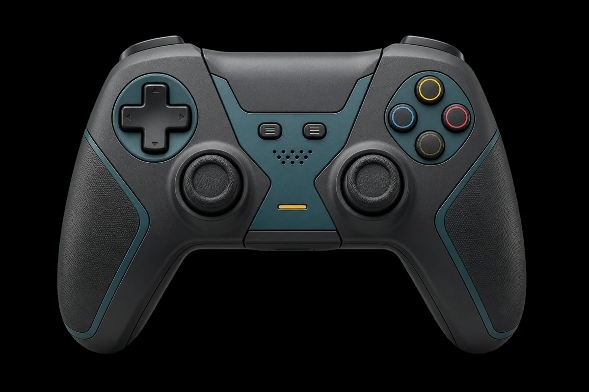
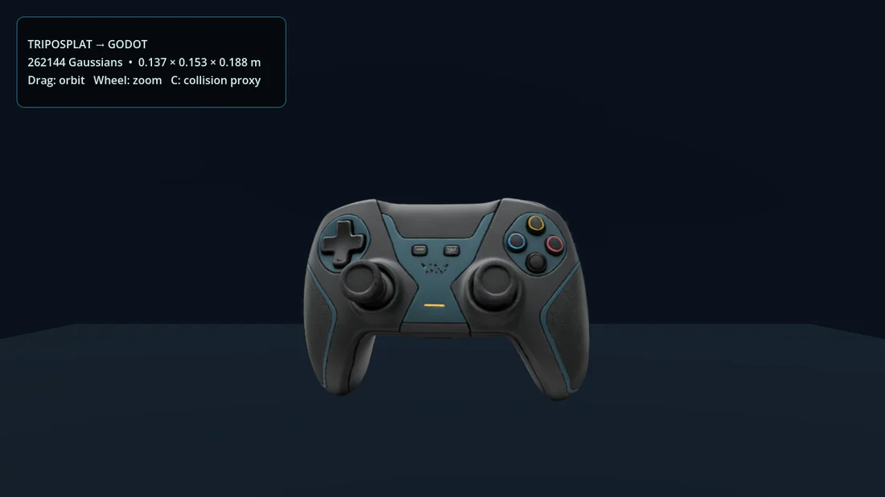
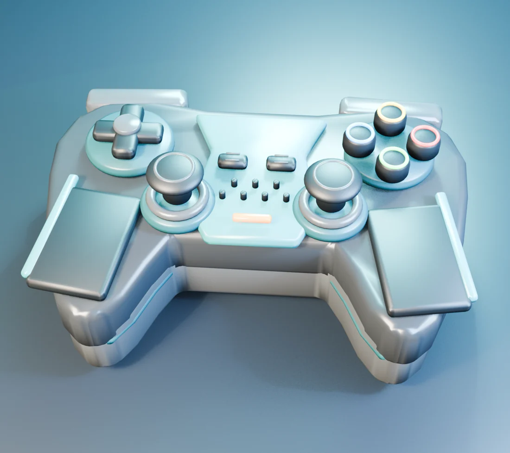

# Forge3D

Forge3D is a personal, prompt-first toolkit for making game assets with Codex,
Blender, and Godot.

You describe an asset in the Forge3D desktop, ChatGPT, or the Codex CLI.
Forge3D chooses a practical route, creates an editable Blender source when the
asset needs real geometry, and checks the game-facing result in Godot. It is a
focused local application and toolkit, not a daemon, hosted web app, asset
database, or universal text-to-3D model.



## The two main asset routes

There is no single representation that is best for every prop. Forge3D keeps
two routes because they solve different problems.

| Route | Use it for | Result |
| --- | --- | --- |
| **TripoSplat** | Static props and background objects where matching the reference image matters most | Gaussian `.splat`/`.ply` visual data plus an authored collision proxy |
| **Authored Blender** | Hard-surface props, buildings, mechanical assets, characters, and anything that must be edited or animated | Editable `.blend`, conventional mesh, materials, collision, and validated `.glb` |

TripoSplat is not polygon geometry. It can look remarkably close to the input
image, but it is not suitable for skeletal deformation, ordinary mesh editing,
or a normal GLB export. Use it for visual static objects.

The authored Blender route produces real geometry. It is the route for assets
that need rigging, animation, part-level edits, clean collision, or ordinary
engine tooling. Its quality comes from the scoped modelling build and review,
not from pretending that a one-image reconstruction has measured every hidden
surface.

## What is included

- **Blender authoring**: procedural meshes, bevels, materials, UVs, collision
  helpers, LOD source meshes, rigs, animation, retargeting, rendering, and GLB
  export.
- **TripoSplat**: isolated WSL inference for the RTX 4080 SUPER, input
  preparation, Gaussian output, Blender viewing, and Godot rendering.
- **Blender integration**: a pinned Blender MCP add-on and server for inspecting
  real scenes and making small supervised corrections.
- **Godot integration**: the Godot MCP Toolkit and GDGS Gaussian renderer for
  import, runtime review, screenshots, debugger checks, and collision review.
- **Three.js experiments**: small browser-based procedural modelling examples
  under `experiments/threejs/` for fast visual prototyping.
- **Policy and licensing checks**: model metadata, explicit cloud-upload
  approval, versioned outputs, and third-party notices.

## How a request moves through the tool

1. Codex interprets the prompt and chooses an asset route.
2. A reviewed task under `blender/` builds or processes the asset, or the
   isolated TripoSplat worker creates Gaussian data.
3. Blender MCP inspects the actual scene and viewport when an interactive
   review is useful. It is the review and supervised-editing layer, not the
   geometry algorithm.
4. Forge3D saves a new versioned `.blend` and exports a GLB when the asset is
   polygon-based.
5. Godot imports the result and runs the review harness. Godot MCP can inspect
   the running project, capture a view, and expose import or runtime errors.

The `.blend` is the editable source of truth for conventional assets. GLB is
the game-facing export. PLY/SPLAT is the visual master for Gaussian assets.
Generated work is written to `%USERPROFILE%\Documents\Forge3D\runs`. It remains outside source control.

## Example: one controller, two representations

Both images below came from the same controller reference.

### TripoSplat visual asset



This route preserves the reference appearance well. Godot renders the splat
through the vendored GDGS add-on, while Forge3D supplies a simple collision
proxy for gameplay interaction.

### Authored Blender mesh



This route produces editable polygon geometry with UVs, PBR materials, and
collision helpers. It is less photographic, but it can be modified, rigged,
animated, exported, and used by ordinary engine systems.

## Installation

Forge3D 0.2.1 is packaged for Windows x64. The tested external-tool setup is:

- Blender 5.x, including the Steam Blender 5.2 LTS build
- Godot 4.6
- Python 3.11 or newer
- Node.js 22 or newer
- `uv`
- WSL2 Ubuntu with NVIDIA CUDA access for local TripoSplat inference
- An NVIDIA GPU with at least 8 GB VRAM; local testing used an RTX 4080 SUPER
  with 16 GB

Normal users install the verified managed bundle through Instrumenta. A
source checkout is an explicit developer override. To prepare that checkout:

```powershell
.\scripts\setup.ps1 -InstallModels -InstallPersonalPlugin
forge3d doctor --json
```

Setup installs the editable CLI, the pinned Blender MCP add-on and server,
initializes the Godot review project, and optionally installs TripoSplat in an
isolated WSL environment. Restart Codex after setup so it reloads the local
MCP configuration and Forge3D plugin.

The checked-in `.codex/config.toml.example` is a portable template. The local
`.codex/config.toml` contains absolute paths for the current machine and is
ignored by Git. Set `BLENDER_EXECUTABLE` or pass `-Blender` to the launcher if
Blender is not found automatically. Adjust the Godot executable in
`scripts/setup.ps1` when using a different installation path.

## Usage

The normal interface is the Forge3D desktop Spatial Canvas. Its command ribbon drives the user's
local Codex App Server session, temporary edge drawers expose history and inspection, and the bottom
production rail streams Plan, Build, Check, Output, approvals, artifacts, previews, and validation.
Direct Codex or ChatGPT prompts remain supported, for example:

> Create a game-ready industrial generator. Use authored Blender geometry,
> keep an editable `.blend`, add collision and LODs, inspect it through Blender
> MCP, and validate the GLB in Godot.

For a static visual prop:

> Turn this isolated prop image into a TripoSplat asset, add a simple collision
> proxy, and verify that it renders in Godot.

The CLI is available when a repeatable command is more convenient:

```powershell
forge3d doctor
forge3d models list
forge3d models status

# Local static visual reconstruction. Use a new output folder for each run.
forge3d models run triposplat C:\path\to\reference.png `
  --output-dir C:\path\to\output\prop-splat-v001 `
  --gaussians 262144

forge3d process --help
forge3d rig --help
forge3d animate --help
forge3d retarget --help
forge3d humanoid-retarget --help
forge3d validate --help
```

For stylized humanoids, `humanoid-retarget` uses an untouched human control,
a target T/A-pose, and a versioned profile to transfer rest-relative global
motion while proving limb chains, human leg ordering, deformed facing, and
equipment attachment. See [`docs/humanoid-retarget.md`](docs/humanoid-retarget.md).

Launch Blender with its local MCP bridge when an interactive review is needed:

```powershell
.\scripts\start-blender-mcp.ps1
.\scripts\start-blender-mcp.ps1 -BlendFile C:\path\to\asset-v001.blend
.\scripts\start-blender-mcp.ps1 -Blender C:\path\to\blender.exe
```

Forge3D never overwrites an existing asset output. Create a new versioned
folder for each run.

## TripoSplat input guidance

TripoSplat accepts one image and synthesizes unseen views. For the best result,
use one complete isolated subject with:

- a sharp silhouette and roughly 10–15% margin;
- orthographic-like three-quarter framing;
- neutral, diffuse lighting;
- no text, watermark, foreground occlusion, or crop; and
- a clean alpha channel when possible.

Inspect `prepared-input.webp` before judging the result. The visible side can
be extremely faithful. The rear and underside are plausible synthesis, not
measured multi-view geometry, so orbit the complete object before accepting it.

The tested local baseline uses 20 steps, guidance 3.0, shift 3.0, alpha erosion
radius 1, and 262,144 Gaussians. Godot's GDGS integration handles `.splat`,
`.ply`, `.compressed.ply`, and `.sog` inputs in the review project.

## Model and provider policy

- TripoSplat is the accepted local route for image-faithful static visuals.
- TripoSR is rejected because its tested output had melted hard edges, repeated
  surface striations, incorrect proportions, and severe non-manifold geometry.
- Poisson and voxel reconstruction from splats were tested and rejected as
  visual-asset routes. They remain useful only for rough proxy generation.
- SPAR3D is an optional local image-to-mesh candidate only after its current
  license, gated access, registration, revenue, attribution, and AUP terms are
  confirmed.
- TripoSG and PartCrafter are restricted to explicit evaluation because their
  published inference paths include non-commercial BRIA RMBG-1.4 terms.
- Cloud providers never receive an input without approval for that exact job.
  The Tripo adapter is pay-per-use and requires approval per upload.

Run `forge3d models info <name>` for recorded capability and license notes.

## Repository layout

```text
blender/       Repeatable Blender tasks and authored asset build scripts
desktop/       Sandboxed Electron client, previews, tests, and Windows package
docs/          Architecture, schema, release guides, and showcase images
experiments/   Technology-grouped Three.js and TripoSplat research
godot/         GLB review harness, Godot MCP toolkit, and GDGS renderer
instrumenta/   Product-manifest integration boundary
packaging/     Instrumenta release-manifest template
plugins/       Personal Codex plugin and Forge3D skill
references/    Selected modelling references and prompts
scripts/       Setup, packaging, MCP launchers, cloud adapter, and WSL workers
src/forge3d/   Dependency-light host CLI
tests/         Python integration and policy tests
vendor/        Small pinned third-party source required by setup
```

The production path is intentionally local and bounded. The Electron desktop is a
rich client; there is no network daemon, database, hosted web UI, or generic workflow framework.

## Desktop documentation

- [`docs/desktop-architecture.md`](docs/desktop-architecture.md) covers Electron security, the Codex
  App Server lifecycle, approvals, plugin repair, previews, and external tool discovery.
- [`docs/run-schema-v2.md`](docs/run-schema-v2.md) defines run history, relative artifacts, v1
  compatibility, recovery, archive, duplicate, and trash behavior.
- [`docs/releasing.md`](docs/releasing.md) covers Windows packaging, release verification, audits,
  and troubleshooting.

## Validation

Before handing off an asset or changing the pipeline:

```powershell
forge3d doctor --json
uv run --with pytest pytest -q
.\blender\tests\smoke.ps1
```

The Godot harness also runs headlessly against exported GLB files. Game-facing
work should include a Godot MCP import/runtime review. Splat work should be
reviewed in the GDGS scene with its collision proxy enabled.

## Known limitations

- This is a packaged Windows x64 personal tool, not a cross-platform application.
- Authored modelling is targeted procedural Blender work assisted by an LLM,
  not a universal text-to-mesh model. Organic characters still need an
  appropriate source mesh or deliberately selected reconstruction backend.
- The humanoid proof catches rest-axis, joint-chain, facing, and attachment
  failures, but each production asset still needs played visual approval plus
  foot-contact, loop, and root-motion review.
- Gaussian splats are static visual props. They do not provide normal polygon
  editing, skeletal deformation, or ordinary GLB export.
- The bundled controller `.splat` is an 8 MB demonstration asset. Larger runs
  belong in ignored `output/` storage or Git LFS.

## License

Forge3D is MIT licensed. Bundled integrations retain their own notices; see
[`THIRD_PARTY_NOTICES.md`](THIRD_PARTY_NOTICES.md).
